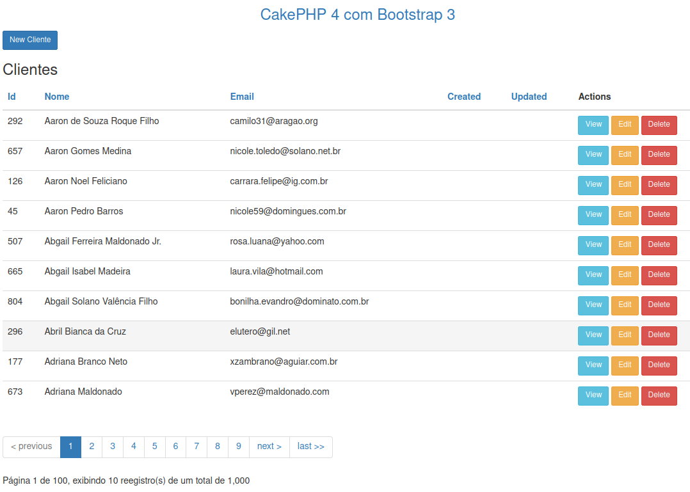

# Usando o Bootstrap no CakePHP 4

Procurei várias formas de implementar o bootstrap no CakePHP 4 e não fiquei satisfeito com as poucas alternativas encontradas.

Então usei o CDN do Bootstrap 3 (pois com o 5 não consegui arrumar a paginação) no templates/layout/default.php e apliquei as classes nas views.

O resultado está em:

https://github.com/ribafs/cakephp4-bootstrap

Instalei o CakePHP versão 4 com:

composer create-project --prefer-dist cakephp/app cake4-bs

cd cake4-bs

Criei o banco cake e importei o script clientes.sql do raiz

Configurei o banco em config/app_local.php e a roda default em config/routes.php

Gerei o CRUD clientes usando o bake

bin/cake bake all clientes

Acessar com

http://localhost/cake4-bs

## Implementar o Bootstrap 3

Usar o CDN em

templates/layout/default.php

Logo abaixo desta linha:

    <link href="https://fonts.googleapis.com/css?family=Raleway:400,700" rel="stylesheet">

Adicionar:

    <link rel="stylesheet" href="https://maxcdn.bootstrapcdn.com/bootstrap/3.4.1/css/bootstrap.min.css">

E comentar esta:

    <?php //$this->Html->css(['normalize.min', 'milligram.min', 'cake']) ?>

Isso já muito o layout mas nada agradável:

http://localhost/cake4-bs

Agora vamos mexer nas views de Clientes

Veja o resultado

