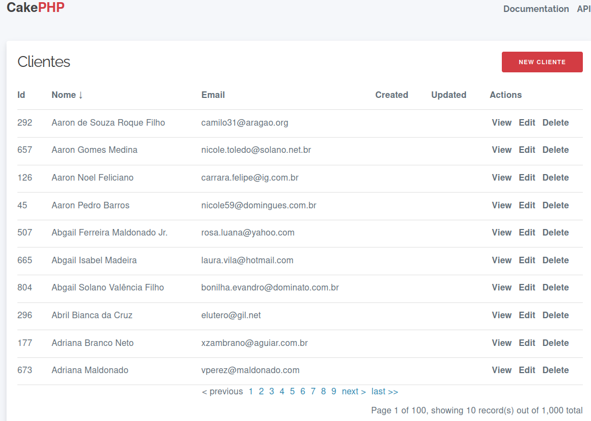

# Criação de um CRUD com CakePHP 4

A forma mais simples de se criar um CRUD, que conheço, é usando o framework CakePHP. Com apenas um comando no terminal/prompt.

Além de muito simples a criação, também vem com bons recursos:

- Paginação
- Ordenação pelos rótulos dos campos
- Suporte a relacionamento entre as tabelas

## Instalar o CakePHP

cd /var/www/html ou cd c:\xampp\htdocs

composer create-project --prefer-dist cakephp/app crud

## Criar o banco crud e configurar em config/app_local.php
```
    'Datasources' => [
        'default' => [
            'host' => 'localhost',
            'username' => 'root',
            'password' => 'root',
            'database' => 'crud',
```
Aproveitar e configurar a rota default em config/routes.php

        $builder->connect('/', ['controller' => 'Clientes', 'action' => 'index']);

//        $builder->connect('/', ['controller' => 'Pages', 'action' => 'display', 'home']);

Salvar e importar o script clientes.sql do rzia para o banco criado

cd crud

## Gerar o CRUD clientes

bin/cake bake all clientes

## Acessar

http://localhost/crud

## Resultado


